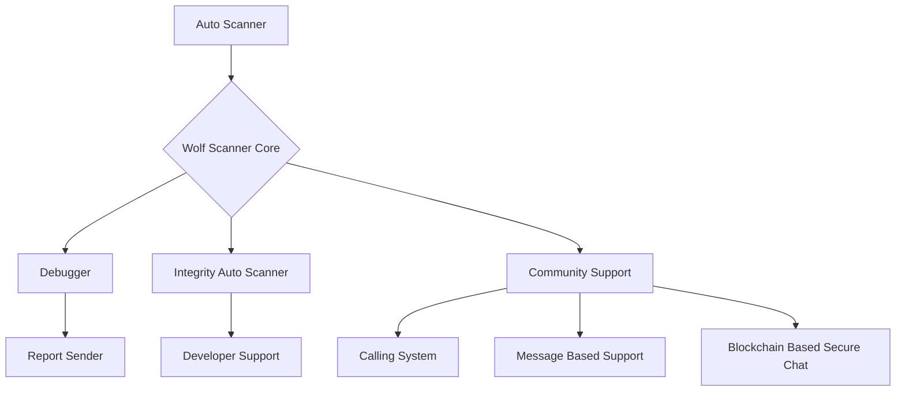

## Wolf Scanner Additional Security Features

### Community Support Devotions (Features)

- **Call Notes System**  
  Developers and community members can record investigation notes during security discussions.

- **Message-Based Support**  
  Built-in messaging for reporting vulnerabilities, debugging issues, and developer collaboration.

- **Blockchain-Based Secure Chat**  
  Secure and tamper-resistant communication system using blockchain concepts to protect security discussions.

- **Community Collaboration**  
  Ethical hackers, developers, and contributors can share findings and improvements.

