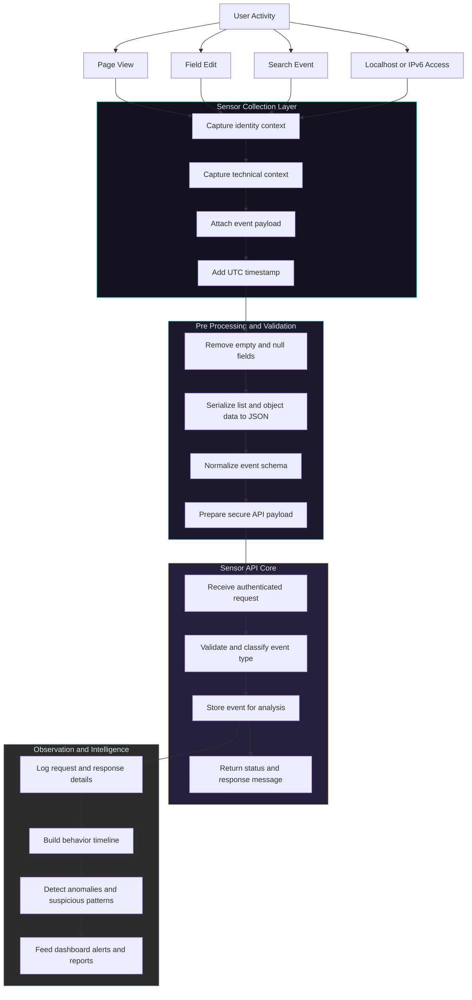

## Cyber Wolf – Smart Sensor Analytics
<p align="center">
  
</p>

**Hackathon**: The Hackindia Hackathon 2026 (MEC)  
**Team**: Cyber Wolf

### Project Purpose
- **Goal**: Turn raw user activity on web applications into structured security and behavior telemetry.  
- **Problem**: Most small teams lack an easy way to capture, standardize, and test security‑relevant events (page views, field edits, searches, localhost access) in a single pipeline.  
- **Solution**: Cyber Wolf provides a unified sensor layer that collects key interaction events, enriches them with context (IP, user, device, time), sends them to a central API, and logs everything for analysis, anomaly detection, and audit.

### Project Abstract
Cyber Wolf is a lightweight sensor framework for web applications that focuses on high‑quality, security‑aware event data. The system generates structured events for common user actions (page views, profile edits, searches, localhost/IPv6 access) and delivers them to a central sensor API with consistent formatting and logging. By cleaning the payload, converting complex structures to JSON, and persisting detailed logs, Cyber Wolf makes it easy to replay, inspect, and extend telemetry without changing core business logic. The result is a practical foundation for intrusion detection, usage analytics, and compliance reporting tailored for hackathon‑scale projects.

### Working Flowchart (High‑Level Logic)



```text
[User interacts with web app]
                |
                v
[Sensor layer builds structured event]
  - user identity (name, email, profile)
  - technical context (IP, URL, user-agent)
  - event type (page_view, field_edit, page_search, localhost_ipv6)
  - optional payload / field history
                |
                v
[Event pre-processing]
  - remove empty or None values
  - convert complex data (lists/dicts) to JSON strings
                |
                v
[Cyber Wolf Sensor API endpoint]
  - receive HTTP request
  - validate and store event
  - respond with status + message
                |
                v
[Logging & Observation Layer]
  - write detailed logs for each request/response
  - enable debugging and replay of test events
                |
                v
[Security & Analytics Use-Cases]
  - detect suspicious activity patterns
  - analyze usage (searches, page views, edits)
  - feed dashboards, alerts, and reports
```

### Key Features and Enhancements

| **Feature**                          | **Description**                                                                 | **Benefit for Hackindia 2026**                                  |
|--------------------------------------|---------------------------------------------------------------------------------|------------------------------------------------------------------|
| Unified sensor event model           | Standard schema for different user actions (views, edits, searches, localhost) | Easier to extend demo with new event types during the hackathon |
| Rich contextual metadata             | Captures IP, URL, user-agent, user identity, page titles, timestamps           | Better security analysis and user behavior insights              |
| Clean and structured payloads        | Removes empty fields and serializes complex structures to JSON                 | Stable, API‑friendly telemetry that is simple to store and query|
| Detailed request/response logging    | Logs every event sent and every API response                                    | Fast debugging on stage; transparent demo for judges            |
| IPv6 and special‑case support        | Explicit testing of localhost/IPv6 scenarios                                   | Shows attention to real‑world edge cases and infrastructure     |
| Plug‑and‑play test harness           | Reusable script to generate realistic test events                               | Quick reproducible demos, easy to showcase multiple scenarios   |


